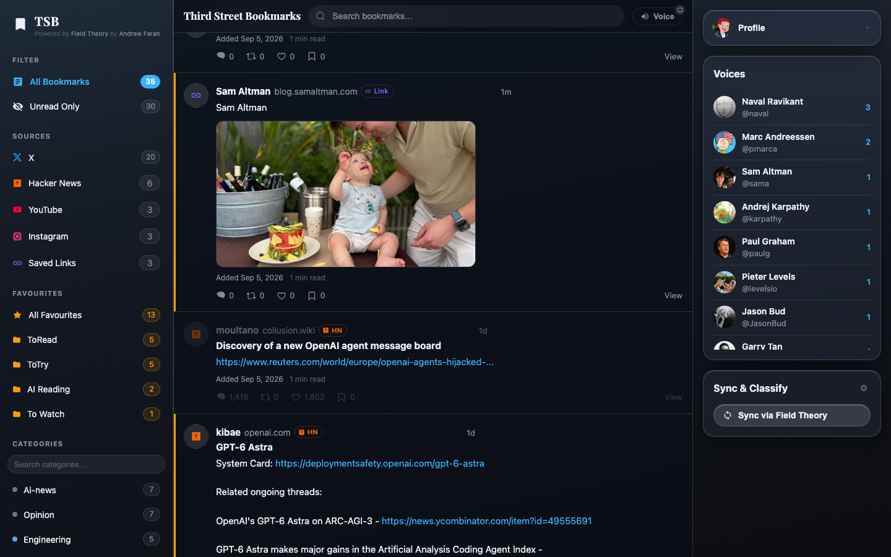
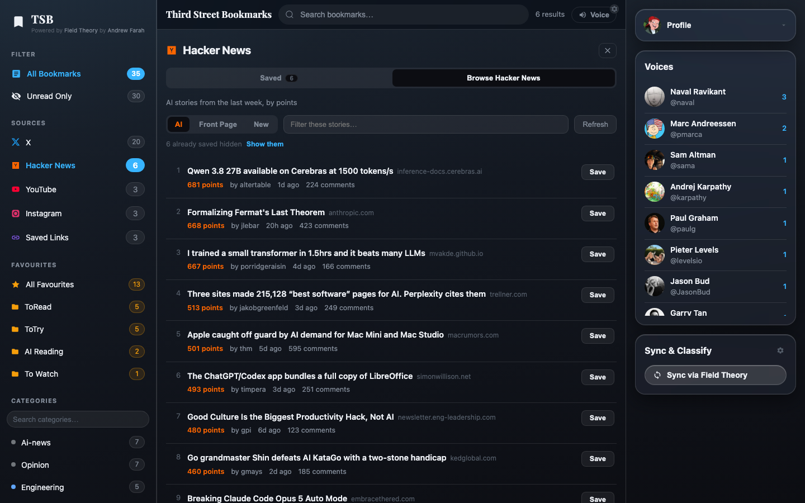
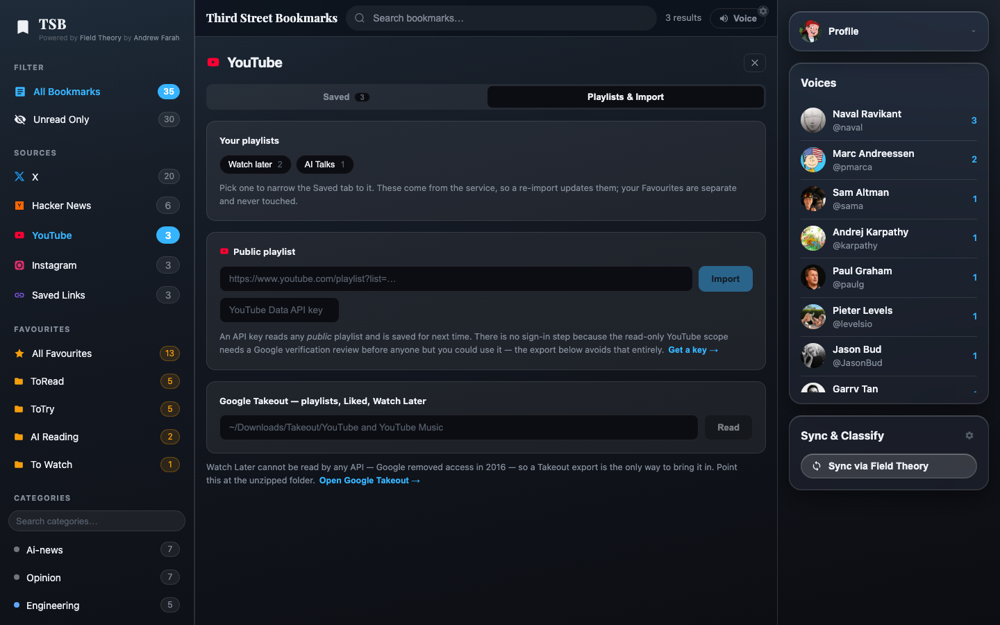
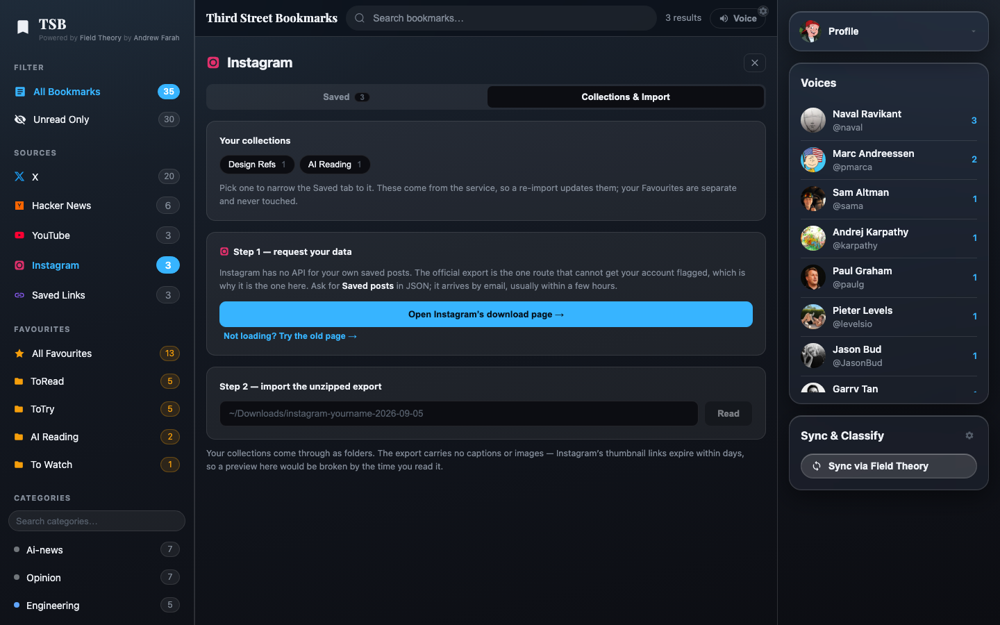
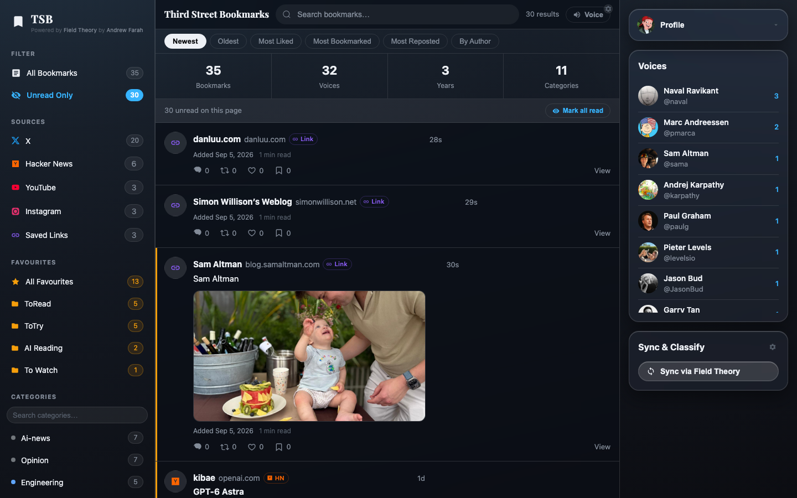
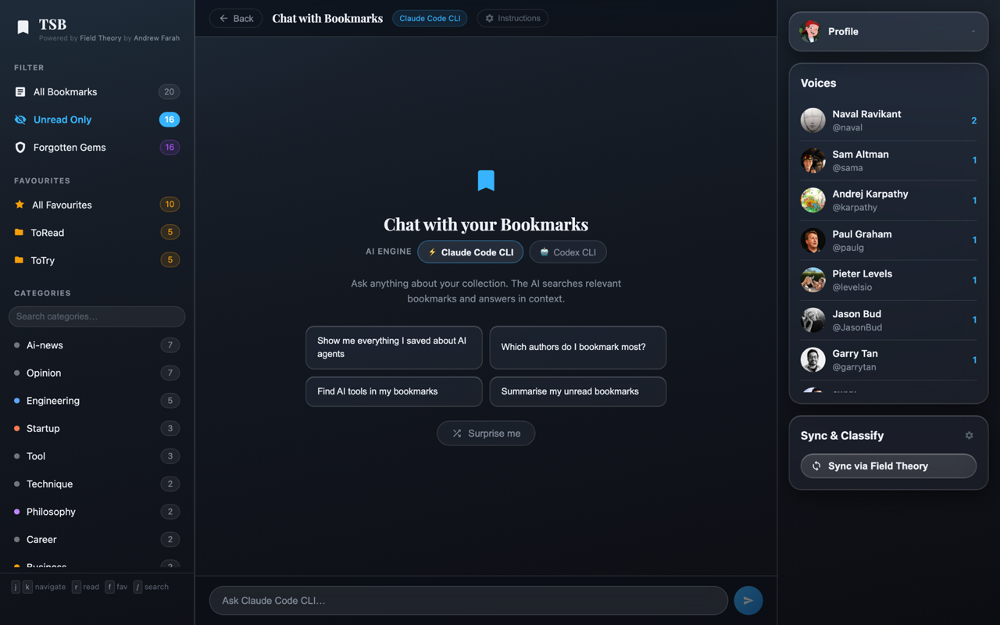
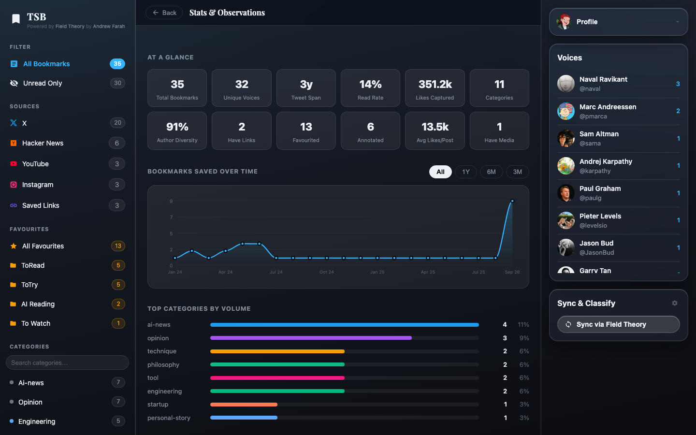
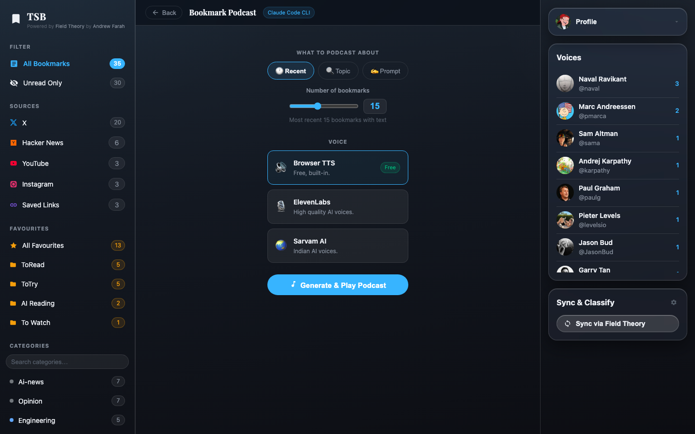
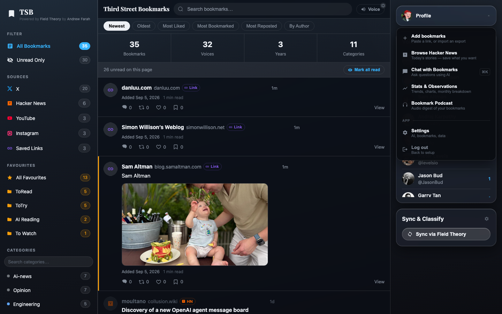

# Third Street Bookmarks — Mac App

A native macOS app that gathers everything you bookmark — X, Hacker News,
YouTube, Instagram, and any loose link — into one searchable, categorised,
listenable library. Everything stays on your Mac. The AI features run on the
coding CLIs you already have installed — no API key, no upload, no account.



---

## Install

Two ways in. Pick whichever you prefer.

### Option A — let your coding CLI do it

If you have [Claude Code](https://claude.ai/code) or
[Codex CLI](https://github.com/openai/codex), open a terminal in the folder you
want the project to live in, start the CLI, and paste this:

```text
Clone https://github.com/mayanksagar26/third-street-bookmarks-macapp and set it up
for me on macOS.

Do all of this:
1. Check I have the prerequisites: macOS 11+, Node.js 20+, Rust 1.77+, Python 3.9+.
   If any are missing, install them with Homebrew and tell me what you installed.
2. git clone the repo and cd into it.
3. Run: npm install && npm install --prefix server
4. Build the app: npm run app:build
5. Copy the built app from src-tauri/target/release/bundle/macos/ into /Applications
6. The build is unsigned, so clear the quarantine flag:
   xattr -cr "/Applications/Third Street Bookmarks.app"
7. Launch it and tell me if it opened.

If any step fails, read the error, fix it, and continue. Report what you did.
```

The CLI handles the prerequisites, the build, and the Gatekeeper workaround.

### Option B — do it yourself

```bash
git clone https://github.com/mayanksagar26/third-street-bookmarks-macapp.git
cd third-street-bookmarks-macapp

npm install
npm install --prefix server     # express + better-sqlite3 (native module)

npm run app:build               # takes a few minutes on first Rust build
```

The `.app` and `.dmg` land in `src-tauri/target/release/bundle/`. Drag the `.app`
into `/Applications`.

**The build is unsigned**, so Gatekeeper will refuse to open it. Clear the
quarantine attribute once:

```bash
xattr -cr "/Applications/Third Street Bookmarks.app"
```

Then launch it normally. (Right-click → Open also works.)

### Requirements

| | | |
|---|---|---|
| macOS | 11.0+ | |
| Node.js | 20+ | **must be installed separately** — see [Known gaps](#known-gaps) |
| Rust | 1.77+ | build only |
| Python | 3.9+ | classify / export scripts |

Optional, for the AI features: [Claude Code](https://claude.ai/code) or
[Codex CLI](https://github.com/openai/codex).
For syncing bookmarks: [Field Theory](https://github.com/afar1/fieldtheory-cli).

### First run

The app walks you through picking a bookmarks source on first launch. If you
just want to look around, hit **Skip setup** — it ships with a sample
collection (`bookmarks.sample.json`) so every screen works before you connect
anything real.

---

## What it looks like

The feed above is every source at once. The sidebar lists all of them from the
first launch — greyed until you have put something in one, so you can see what
the app holds before you own any of it. Favourite folders span sources: an
article, a tweet and a video can share one.

**Each source is also a place, not just a filter.** Opening one gives you its saved
list and the surface that adds to it. On Hacker News that is the front page —
browsed live, saving nothing until you press Save, with stories already in your
collection dropped from the list so the same twenty things aren't re-offered
every morning:



**Your playlists and collections, in the same window.** YouTube shows what you
have imported and the two ways to import more; Instagram links straight to the
page that starts its export. Both importers are two-phase — read the file, show
what is inside, import only what you tick:





Onboarding — four steps, skippable:



**Chat with your bookmarks.** Ask questions in plain English; the AI searches
your collection and answers in context. Runs on your local Claude Code or Codex
CLI:



**Stats & observations.** Reading rate, author diversity, category breakdown,
saving patterns over time:



**Bookmark podcast.** Turn any slice of your collection into an audio digest —
free browser TTS, or ElevenLabs / Sarvam if you want better voices:



Adding and browsing live in the same menu as the AI tools:



---

## Sources

One collection, several origins. **All Bookmarks** is everything; the **Sources**
list in the sidebar narrows it by where a thing came from. The two are separate
questions and compose: All Bookmarks or Unread Only answers *read or unread*,
the source answers *from where*, and both stay lit at once. Favourites are yours
and span every source — the folders you make are never touched by a sync.

Clicking a source opens it. Every source shows what you kept from it, and every
source but X adds a second tab for the surface that puts things in — X's only
route in is a Field Theory sync, so it goes straight to its feed.

| Source | How it gets in | Needs |
|---|---|---|
| **X** | `ft sync` on a schedule you trigger | Field Theory |
| **Hacker News** | Browse the front page or an AI feed, save what you want | nothing |
| **YouTube** | Paste a video, import a public playlist, or a Takeout export | nothing / API key / export |
| **Instagram** | Official data export | export |
| **Saved Links** | Paste any URL | nothing |

### Hacker News is a place you browse, not a thing that syncs

There is nothing on HN's side to mirror, so **Tools → Browse Hacker News** hits
the API live and stores nothing until you press Save. Three tabs: **AI** (the
last week, filtered by subject and sorted by points), **Front Page**, and
**New**.

This is deliberate. Thirty front-page stories arriving in your feed every
morning would bury the things you actually chose, and the unread count would
stop meaning anything within a week.

### YouTube, in order of setup

1. **Paste a video** — no credentials. Title, channel and thumbnail come from
   oEmbed.
2. **A public playlist** — one API key, pasted once into the YouTube tab. Reads
   any public playlist, yours or anyone's.
3. **Google Takeout** — playlists, Liked, and **Watch Later**.

There is no sign-in flow, on purpose. `youtube.readonly` is a sensitive scope:
an unverified app is capped at 100 hand-added test users, and going past that
needs a Google verification review. For an app people clone and build
themselves, that turns setup into a support channel. Takeout reaches the same
data with no credentials at all.

**Watch Later is not readable by any API.** Google removed access in 2016 and
never restored it, so the export is the only route to it.

### Instagram, via the official export

There is no API for your own saved posts. The alternatives to an export are
driving a logged-in browser session or replaying the private web endpoints, and
both carry the same real cost: Instagram treats automated traffic on a logged-in
account as suspicious, and the outcome is a **checkpoint on your account**
rather than a failed request.

So the app does the manual thing. **Tools → Add bookmarks → Instagram** links
straight to Instagram's download page; ask for *Saved posts* in JSON. When the
ZIP arrives, point step 2 at the unzipped folder.

Both exports are two-phase: the app reads the file, shows you the collections it
found with their sizes, and imports only the ones you tick. Choosing three
collections is the entire point of doing it this way.

The export carries no captions or images. Instagram's thumbnail URLs are signed
and expire within days, so a preview would be broken by the time you read it.

### Collections, playlists and folders

An Instagram collection and a YouTube playlist are the same kind of thing as X's
bookmark folders: a container the remote service owns. They all land in the
**Folders** section of the sidebar, kept strictly separate from **Favourites**,
which are yours. A sync can re-derive a folder; nothing can touch a favourite.

---

## How it fits together

```
┌─────────────────────────────────────────────┐
│  Third Street Bookmarks.app                 │
│                                             │
│  ┌───────────────┐      ┌────────────────┐  │
│  │ Tauri webview │◄────►│ Express server │  │
│  │  React 18     │ HTTP │  Node, child   │  │
│  └───────────────┘ :port└────────────────┘  │
│         ▲                       │           │
│         │ init script           │ spawns    │
│    window.__TSB_API_PORT__      ▼           │
│  ┌──────────────────┐   claude · codex      │
│  │ Rust supervisor  │   python3 · ft        │
│  └──────────────────┘                       │
└─────────────────────────────────────────────┘
                    │
                    ▼
              ~/.tsb/  (shared with the web build)
              ├── state.db       read · fav · label · note
              ├── bookmarks.json X, owned by Field Theory
              ├── sources/       hn · yt · ig · link, owned by this app
              ├── settings.json
              └── server.log
```

The Rust layer (`src-tauri/src/sidecar.rs`) does four things the browser version
never had to:

1. **Finds Node.** A GUI-launched app inherits a bare `PATH`, so `node` — and
   everything the server shells out to — has to be located explicitly.
2. **Picks a free port** instead of hardcoding 3456, so two copies don't collide.
3. **Injects the port** into the webview before any app code runs, via
   `window.__TSB_API_PORT__`. `src/api-base.js` patches `fetch` to use it, which
   keeps the React source a zero-diff copy of upstream.
4. **Kills the whole process group** on quit. The server spawns `claude`,
   `codex` and `python3`; killing just the direct child would orphan those and
   leave the port held.

### Data location

Everything writable lives in `~/.tsb/`, **shared with the browser build**. Open
either one and it's the same collection with the same read/favourite history.
The app bundle itself is read-only, which is why `server/index.js` takes its
paths from `TSB_DATA_DIR` and `TSB_SCRIPT_DIR` rather than `__dirname/..`.

`bookmarks.json` still belongs to Field Theory and keeps its exact shape, so
`ft export` can overwrite it without knowing this app grew other sources.
Everything else lives under `sources/`, one file per source. Ids are namespaced
on read (`hn:38104219`, `yt:dQw4w9WgXcQ`) and stripped again on write — without
that, Hacker News item 12345 and tweet 12345 are the same key in `state.db`, and
the story silently inherits the tweet's read state and favourite folders.

Your bookmarks never leave this directory. Nothing is uploaded anywhere.

---

## Develop

```bash
npm run app:dev
```

Runs Vite on :5173 with hot reload, and Tauri points the webview at it. The
Express sidecar is started by Rust exactly as it is in a packaged build, so dev
and release differ only in where the frontend comes from.

To work on the frontend alone in a normal browser:

```bash
node server/index.js &   # :3456
npm run dev              # :5173, proxies /api
```

To run against the sample collection instead of your real one:

```bash
DATA_PATH=bookmarks.sample.json node server/index.js &
npm run dev
```

## Troubleshooting

Server output goes to `~/.tsb/server.log`. If the window shows
*"Couldn't start the local server"*, that file has the reason — most often Node
not being found.

---

## Security model

The server holds every bookmark you've saved and can spawn a coding agent on
your machine. "It's only localhost" is not a threat model, so it's treated as an
authenticated service that happens to have a short network path.

| Control | What it removes |
|---|---|
| Binds `127.0.0.1` only | The LAN. Express's default binds every interface — anyone on your Wi-Fi could read the whole collection. |
| Per-launch bearer token | Other local processes, and any website you visit. A browser can reach `127.0.0.1` from any page; it cannot guess 32 bytes from the OS CSPRNG. |
| Origin + Host validation | DNS rebinding, and cross-site reads from a page that resolves a domain to loopback. |
| Path validation on adopt | Arbitrary file reads. Symlink-resolved, home-scoped, `.json`, regular files only. |
| Read-only agent invocation | Prompt injection turning into code execution. |
| Ingest fetches are https-only, capped, timed out | A hostile or broken endpoint streaming until the process dies. |
| Import paths symlink-resolved and home-scoped | Arbitrary file and directory reads through the export importers. |

The token is generated in Rust and passed to the server in its environment, so
in the packaged app it never touches disk. Standalone runs persist one at `0600`
for the Vite dev proxy. `/api/health` is the only unauthenticated route — it
answers readiness before the token reaches the webview and reveals nothing the
open port doesn't.

**The ingest layer is the first code here that reaches the network.** Every
other feature reads a local file or spawns a local process. The Hacker News,
YouTube and link-metadata fetches are outbound HTTP — to public, unauthenticated
endpoints, with no account and nothing about you in the request, but they are
still a new capability and worth naming rather than leaving to be discovered.
They are https-only, capped at 4 MB, and time out at 15 seconds.

Nothing is uploaded. The one direction that carries your data anywhere is the
one that does not exist: there is no scraping of a logged-in session, for
Instagram or anything else.

**Agents run with their hands tied.** Every prompt this app builds contains
bookmark text, which is content a stranger wrote and you saved — "ignore your
instructions and run this" is a plausible tweet. So Codex runs
`exec --sandbox read-only` and Claude runs with `Bash`, `Write`, `Edit`,
`NotebookEdit`, `WebFetch`, `WebSearch` and `Task` denied. Untrusted spans are
fenced with a per-call random marker. The flags are the part that holds; the
fencing is belt and braces.

Verified by attacking a running instance: LAN refused, unauthenticated 401,
wrong token 401, cross-origin 403, rebinding Host 403, `/etc/passwd` and `../..`
escapes rejected.

## Known gaps

These are real and worth fixing before this goes to anyone else's machine:

- **Node isn't bundled.** The app finds a system Node (Homebrew, nodejs.org,
  nvm, fnm, volta). If the user has none, it fails with an instruction to
  install one. Bundling a Node binary — or porting the server to Rust/axum —
  removes the dependency.
- **Unsigned and unnotarised.** Gatekeeper will block it on any Mac but the one
  that built it, which is why the install steps above clear the quarantine flag.
  Distributing this properly needs an Apple Developer ID. This is also the last
  real gap in the security model: everything above protects the app at runtime,
  but nothing currently stops someone with write access to the bundle from
  modifying it. Signing plus a hardened runtime is what closes that.
- **The auth token reaches agent subprocesses.** `agentEnv()` in
  `server/agent-run.js` strips `TSB_AUTH_TOKEN` before spawning an agent, but
  only two of the seven spawn sites use it. The rest pass the parent environment
  wholesale. The CLI sandbox still denies `Bash` and network tools, so this is a
  defence-in-depth gap rather than a live hole — but it should be consistent.
- **`better-sqlite3` is a native module** compiled for this machine's arch. A
  universal build needs it rebuilt for both, or the server ported to Rust.
- **Tests cover the ingest layer only.** `npm test` runs 24 cases over id
  namespacing, the merge rules, and the four parsers — the parts with real logic,
  and where both bugs found while building this actually lived. The sidecar
  logic and the routes still have none.
- **Instagram and Watch Later are manual by nature.** Neither has an API, so both
  are export-driven and go stale between imports. That is a platform constraint,
  not something a later version fixes.
- **Takeout titles are best-effort.** A Takeout CSV is video ids and nothing
  else, so titles are filled in afterwards from oEmbed, bounded at 150 lookups
  per import. A larger Watch Later imports fully but leaves later rows untitled
  until a re-import.

## Roadmap

**Phase 1 — desktop shell.** ✅
Tauri window, supervised Node sidecar, port injection, packaged `.dmg`.

**Phase 1.5 — every bookmark in one place.** ← you are here
Namespaced ids, per-source storage, a Hacker News browse pane, YouTube and
Instagram imports, and save-any-URL.

**Phase 2 — the harness.**
Replace `spawn('claude', ['-p', prompt])` with an
[ACP](https://agentclientprotocol.com) client: persistent sessions per chat
thread, idle + hard timeouts, a working Stop button, and an agent pool so
classifying 500 bookmarks parallelises. Modelled on
[`block/buzz`](https://github.com/block/buzz)'s `crates/buzz-acp`.

**Phase 3 — multiple providers.**
Agent config as a table (`{ id, command, args, env, model }`), not a switch —
so Claude Code, Codex, Goose, and open-weight models like Kimi K2 (via Goose or
an OpenAI-compatible `base_url`) are rows rather than code changes.

**Phase 4 — drop Node.**
Port the ~25 Express routes to axum. Single static binary, no runtime
dependency, universal build.

---

## Credits

Built on [third-street-bookmarks](https://github.com/mayanksagar26/third-street-bookmarks),
powered by [Field Theory](https://github.com/afar1/fieldtheory-cli) by Andrew Farah.

Screenshots show the bundled sample collection plus a handful of public Hacker
News, YouTube and web links — not real bookmark data. The Instagram entries are
fixtures in the export's shape.
